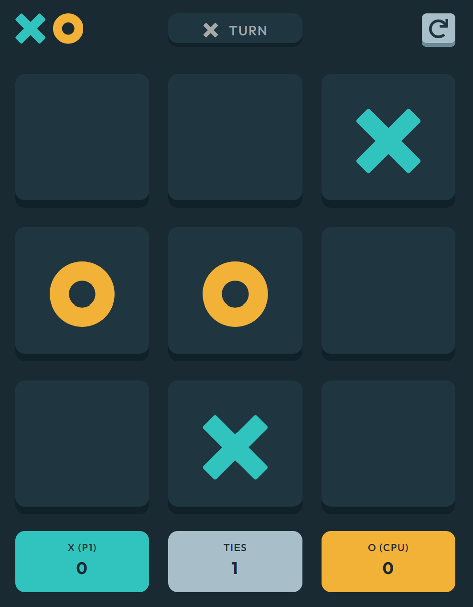

# Frontend Mentor - Tic Tac Toe solution

This is a solution to the [Tic Tac Toe challenge on Frontend Mentor](https://www.frontendmentor.io/challenges/tic-tac-toe-game-Re7ZF_E2v). Frontend Mentor challenges help you improve your coding skills by building realistic projects. 

## Table of contents

- [Overview](#overview)
  - [The challenge](#the-challenge)
  - [Screenshot](#screenshot)
  - [Links](#links)
- [My process](#my-process)
  - [Built with](#built-with)
  - [What I learned](#what-i-learned)
  - [Continued development](#continued-development)
  - [Useful resources](#useful-resources)
- [Author](#author)

## Overview

### The challenge

Users should be able to:

- View the optimal layout for the game depending on their device's screen size
- See hover states for all interactive elements on the page
- Play the game either solo vs the computer or multiplayer against another person
- Close or refresh the browser and come back to finish the game because the game state is preserved.

### Screenshot

### Links

- Live Site URL: [Add live site URL here](https://tic-tac-39g1msp79-ledminh.vercel.app/)

## My process

### Built with

- Semantic HTML5 markup
- CSS custom properties
- Flexbox
- CSS Grid
- Mobile-first workflow
- [React](https://reactjs.org/) - JS library
- [Next.js](https://nextjs.org/) - React framework
- [Styled Components](https://styled-components.com/) - For styles

### What I learned

In this project, I need to manage many different states at the same time and, thus, gain more perspective and appreciation on redux. However, at the beginning, I decided to use only useState hook and sticked with that decision till the end. It is challenging but I think I will use redux next time.

Another thing I learned from this project is the minimax algorithm, which is the algorithm that makes the CPU "smarter". Basically, it use recursion to calculate the winning probability of all senarios and return the best one. 

### Continued development

In future project, I want to focus more on redux and other paradigms of state management. I probably will try to work a little bit on the backend.

### Useful resources

- [Minimax algorithm for Tic Tac Toe](https://www.neverstopbuilding.com/blog/minimax) - This article describes best the minimax algorithms I used to make the CPU "smarter".

## Author

- Website - [LEDMINH.DEV](https://www.ledminh.dev)
- Frontend Mentor - [@yourusername](https://www.frontendmentor.io/profile/ledminh)